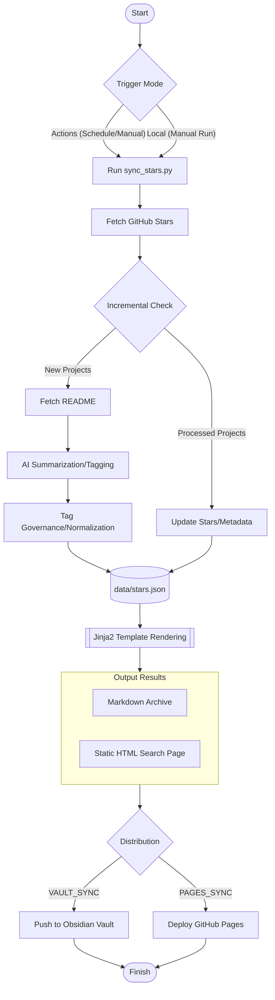

# GitHub Stars Index

English | [中文](README.md)

> Automatically fetch GitHub Stars, generate AI summaries, and make them easily searchable.

## Contents

- [Features](#features)
- [Quick Start](#quick-start)
- [Configuration Reference](#configuration-reference)
- [Obsidian Sync (Optional)](#obsidian-sync-optional)
- [Local Installation](#local-installation)

---

## Features

- 🤖 **Automatic Sync**: Fetches all starred repositories from your GitHub account.
- 📝 **AI Summaries**: Reads each repository's README and uses AI to generate concise summaries and technical tags.
- 🏷️ **Smart Tagging**: Built-in `TAG_MAPPING` for automatic synonym merging and tech stack normalization (e.g., LLM -> Large Language Model), preventing tag explosion.
- ⚡️ **High Performance**: Supports **concurrency** for AI API calls, significantly speeding up the processing of new projects.
- 🗃️ **Data Driven**: Uses `data/stars.json` at runtime and publishes it to `gh-pages/data/stars.json` for custom development.
- 🎨 **Template Driven**: Uses Jinja2 templates to generate Markdown and static HTML search pages.
- ⏭️ **Smart Incremental Updates**: Uses AI for new projects, while **automatically updating star counts and metadata** for existing ones.
- ⏰ **Automated Workflow**: Regularly runs via GitHub Actions with customizable cron schedules.
- 🔄 **Vault Sync (Optional)**: Automatically pushes generated `stars_zh.md` & `stars_en.md` to your **Obsidian Vault**.
- 🌐 **GitHub Pages (Optional)**: Deploys a static search page with multi-language (ZH/EN) support and real-time search.
- 💻 **Flexible AI Providers**: Compatible with any **OpenAI-format API** (OpenAI, Azure, local Ollama, etc.).

---

## Process Overview



---

## Quick Start

### Step 1: Fork This Repository

Click the **Fork** button in the top right corner to copy this repository to your account.

> [!IMPORTANT]
> This site template includes the `analytics.1step.dev` analytics script with `data-website-id` set to `GitHubStarsIndex`. After forking, change it to your own website ID or remove the script at the bottom of `templates/index.html.j2` so your traffic does not appear in the original project dashboard.

### Step 2: Configure the Runtime (Choose One)

The project is driven by environment variables. Script configuration precedence is **built-in defaults < `config.yml` < environment variables**; a local `.env` file is loaded into the environment. GitHub Actions injects Repository Secrets/Variables as environment variables through the workflow.

#### Method A: GitHub Actions (Recommended for continuous runs)

Open **Settings → Secrets and variables → Actions** in your fork.

> [!IMPORTANT]
> - **Secrets** store sensitive API keys and tokens and are read with `${{ secrets.NAME }}`. **Variables** store non-sensitive usernames, model IDs, URLs, and switches and are read with `${{ vars.NAME }}`. They are separate namespaces; a Secret named `GH_USERNAME` does not satisfy `vars.GH_USERNAME`.
> - The current workflow does not declare `environment:`, so create **Repository secrets / Repository variables**, not Environment-level entries.
> - A missing Repository Variable is passed to the workflow as an empty string. Explicitly create the base Variables below so empty values do not override script defaults.

**Repository secrets**

| Name | Required | Description |
| --- | --- | --- |
| `AI_API_KEY` | Yes | API key for the selected AI provider |
| `VAULT_PAT` | Conditional | Required only for cross-repository Obsidian sync; needs Contents: Write on the target repository |
| `GITHUB_TOKEN` | Do not create | GitHub Actions creates one for every job and the workflow injects it automatically |

**Repository variables**

| Name | Recommended value | Description |
| --- | --- | --- |
| `GH_USERNAME` | Your GitHub username | Account whose Stars will be fetched; this must be a Variable |
| `AI_BASE_URL` | See provider examples below | OpenAI-compatible API endpoint |
| `AI_MODEL` | See provider examples below | Model ID exposed by the provider |
| `MAX_CONCURRENCY` | `1` | Start at 1 for the first full sync or subscription/Token Plan APIs |
| `OUTPUT_FILENAME` | `stars` | Generates `stars_zh.md` / `stars_en.md` |
| `PAGES_SYNC_ENABLED` | `true` | Publish GitHub Pages; the site is not deployed when this is missing |
| `VAULT_SYNC_ENABLED` | `false` | Enable Obsidian Vault sync |
| `VAULT_REPO` | `owner/repo` | Required only when Vault sync is enabled |
| `VAULT_SYNC_PATH` | `GitHub-Stars/` | Required only when Vault sync is enabled |

Do not create a `TEST_LIMIT` Repository Variable. In Actions it comes from the `test_limit` input shown when manually running the workflow.

**Common AI provider examples**

| Provider | `AI_BASE_URL` | `AI_MODEL` | Concurrency guidance |
| --- | --- | --- | --- |
| MiniMax Mainland China | `https://api.minimaxi.com/v1` | `MiniMax-M3` | Use `1` for Token Plan full syncs |
| DeepSeek | `https://api.deepseek.com` | Use a model currently available to your account, for example `deepseek-v4-flash` | Start at `5` |
| OpenAI | `https://api.openai.com/v1` | Use a model available to your account | Adjust to account limits |

The API key must match the service region and Base URL. MiniMax Mainland China and global keys are not interchangeable. For gateways or other compatible providers, use the Base URL and model ID documented by that provider.

> [!NOTE]
> “OpenAI-compatible” describes the basic request shape, not universal support for every extension. `response_format`, `thinking`, reasoning fields, and rate-limit policies vary by provider and model. DeepSeek and MiniMax-M3, for example, each expose a thinking toggle, but it is not a universal OpenAI parameter. Do not copy provider-specific extensions without checking that provider's documentation.

> [!TIP]
> **About GitHub API Limits**:
> - **Running Online (Actions)**: The workflow automatically injects `GITHUB_TOKEN` with a high limit (1,000 requests/hour), easily handling heavy crawls.
> - **Running Locally**: Without a `GH_TOKEN`, the limit is 60 requests/hour. If you have many stars, it's recommended to add a `GH_TOKEN` to your `.env` to increase the limit to 5,000 requests/hour.

#### Method B: Using a .env File (Best for local development)

1. Copy `.env.example` to `.env` in the root directory.
2. Fill in the required fields in `.env`.

---

### Step 3: Customize Schedule Frequency

Edit `.github/workflows/sync.yml` to modify the `cron` expression:

```yaml
schedule:
  - cron: "0 2 * * 1"  # Example: Run every Monday at 2 AM
```

### Step 4: Manually Trigger the First Run

Go to **Actions → 🌟 GitHub Stars Index 同步 → Run workflow** and click run.

---

## Configuration Reference

The “script default” column applies to local runs where the corresponding environment variable is absent. The GitHub Actions workflow injects missing Repository Variables as empty strings, so Actions users should explicitly create the base Variables listed in Step 2.

| Variable | GitHub Actions location | Requirement | Description | Script default |
| --- | --- | --- | --- | --- |
| `GH_USERNAME` | Repository Variable | Required | GitHub username to sync | - |
| `AI_API_KEY` | Repository Secret | Required | AI API key | - |
| `AI_BASE_URL` | Repository Variable | Required in Actions | OpenAI-compatible endpoint | `https://api.openai.com/v1` |
| `AI_MODEL` | Repository Variable | Required in Actions | AI model ID | `gpt-4o-mini` |
| `OUTPUT_FILENAME` | Repository Variable | Explicit value recommended in Actions | Markdown filename base | `stars` |
| `MAX_CONCURRENCY` | Repository Variable | Explicit value recommended | Concurrent AI requests; use `1` for Token Plans | `5` |
| `VAULT_SYNC_ENABLED` | Repository Variable | Optional | Enable Obsidian sync | `false` |
| `VAULT_REPO` | Repository Variable | Required with Vault sync | Vault repository (`owner/repo`) | - |
| `VAULT_SYNC_PATH` | Repository Variable | Optional | Target directory in the Vault | `GitHub-Stars/` |
| `VAULT_PAT` | Repository Secret | Required with Vault sync | Token with write access to the target repository | - |
| `PAGES_SYNC_ENABLED` | Repository Variable | Required to publish the site | Pages deploys only when the value is exactly `true` | `false` |
| `GH_TOKEN` | Local `.env` only | Recommended locally | Raises local GitHub API limits; Actions uses its generated `GITHUB_TOKEN` | - |
| `TEST_LIMIT` | Workflow input / local `.env` | Optional | Maximum new repositories per run; do not create an Actions Variable with this name | - |

### Full Syncs and AI Rate Limits

An initial full sync may issue hundreds of AI requests. Subscription or Token Plan APIs commonly enforce concurrency, RPM, TPM, or rolling-window limits. A workflow can finish successfully while some repositories contain “Generation failed.” Recommended procedure:

1. Validate the first run with `force_rebuild=true` and `test_limit=5`.
2. After AI output and Pages deployment work, use `force_rebuild=false` and append `20`–`50` repositories per run with `test_limit`.
3. Set `MAX_CONCURRENCY=1` for MiniMax Token Plan and similar subscription APIs. Increase it gradually only for pay-as-you-go APIs with sufficient limits.
4. On HTTP 429, stop starting new runs, wait for the provider's rate-limit window to recover, then rerun with `force_rebuild=false`. Completed runs resume incrementally from `gh-pages/data/stars.json`; **cancelling an active Action may lose results that have not yet been saved in that run**.
5. After the initial import, scheduled runs call the AI only for newly starred repositories, so normal load is much lower.

---

## Obsidian Sync (Optional)

This feature allows you to automatically push the generated star summaries to your Obsidian Vault (or any other) GitHub repository, keeping your notes updated automatically.

### Core Mechanism
**Cross-repo sync**: Many Obsidian users use GitHub to store and sync their notes. This project uses the GitHub API to push the generated Markdown files directly to your designated Vault repository.

### Setup Steps

1.  **Prepare Target Repository**: Ensure your Obsidian Vault is already hosted on GitHub.
2.  **Create Personal Access Token (PAT)**:
    - Visit the [Fine-grained PAT configuration page](https://github.com/settings/personal-access-tokens).
    - **Repository access**: Choose "Only select repositories" and select your **Vault repository**.
    - **Permissions**: Under "Repository permissions," set **Contents** to **Read and write**.
    - Once generated, add it to this project's **Settings -> Secrets -> Actions** as `VAULT_PAT`.
3.  **Enable Sync Configuration**:
    - In this project's **Settings -> Variables -> Actions**:
        - Set `VAULT_SYNC_ENABLED` to `true`.
        - Set `VAULT_REPO` to `your-username/repo-name` (e.g., `iblogc/my-obsidian-vault`).
        - Set `VAULT_SYNC_PATH` to the desired folder in your Vault (e.g., `Reading/GitHub-Stars/`).
4.  **Save and Finish**: The next time the Action runs, `stars_zh.md` and `stars_en.md` will automatically appear in your Vault repository.

> [!TIP]
> **How to view locally?**
> Once the remote sync is complete, just use the **Obsidian Git** plugin to "Pull," or run `git pull` in your local vault directory. The latest star summaries will then appear in your note library.

---

## GitHub Pages Deployment (Optional)

This project automatically generates multi-language static web pages with real-time search functionality.

1. Explicitly set the Repository Variable `PAGES_SYNC_ENABLED=true`. The current script default is `false`; when the variable is missing, the deploy step is **Skipped** even though the overall Action may still appear successful.
2. On the first run after a fork, use `force_rebuild=true` and `test_limit=5` to remove inherited data from the upstream repository and validate deployment.
3. Confirm that the “Deploy to GitHub Pages” step actually ran successfully, then open **Settings → Pages**.
4. Set **Source** to `Deploy from a branch`, select the `gh-pages` branch and `/(root)` folder, then save.
5. Wait 1–5 minutes and open `https://<username>.github.io/<repository>/`. For example, `van14shu/GithubStarsIndex` maps to `https://van14shu.github.io/GithubStarsIndex/`.
6. After the test succeeds, use `force_rebuild=false` with an empty `test_limit` or continue in batches to import the remaining Stars.

> [!IMPORTANT]
> **Data Source Migration (Compatibility for Forks)**:
> - The current recommended data source is `gh-pages/data/stars.json`.
> - `data/stars.json` in the `main` branch is only used for initial migration compatibility.
> - Normal runs will no longer commit `data/stars.json` back to the `main` branch.
> - A fork may inherit the upstream `gh-pages` branch. If the first run does not enable Pages or the deploy step is skipped, your Pages URL will still show the original author's site. Run with `force_rebuild=true` and confirm a successful deploy to replace it.

---

## Docker Deployment

If you want to run this long-term on a server with automatic synchronization, Docker Compose is recommended.

### 1. Configuration
Copy `.env.example` to `.env` and fill in the necessary information:
```bash
cp .env.example .env
# Edit .env to fill in GH_USERNAME, AI_API_KEY, and GH_TOKEN
```

> [!IMPORTANT]
> **GH_TOKEN is Mandatory**: In Docker environments, calling the GitHub API without a token easily triggers [Rate Limiting](https://docs.github.com/en/rest/using-the-rest-api/rate-limits-for-the-rest-api). Configuration increases the limit from 60 to 5,000 requests per hour.

### 2. Start Service
Launch with Docker Compose:
```bash
docker compose up -d
```
This starts two containers:
- `sync`: The core sync script. By default, it runs every **24 hours**. You can adjust this by setting `SCHEDULE_HOURS` in your `.env`.
- `web`: An Nginx-based static server for viewing the generated index.

### 3. Access the Page
Open your browser and visit: `http://localhost:8080`

### 4. Management Commands
```bash
# View sync logs
docker logs -f github-stars-sync

# Run a manual sync immediately
docker compose run --rm sync

# Update page rendering only (skip AI calls)
docker compose run --rm sync --render-only
```

---

## Local Installation

```bash
# Clone the repository and install dependencies
git clone https://github.com/iblogc/GithubStarsIndex.git
cd GithubStarsIndex

# Install dependencies
pip install -r requirements.txt
# Or use uv (recommended)
uv pip install -r requirements.txt

# Configure using .env
cp .env.example .env
# Edit .env and fill in AI_API_KEY and GH_USERNAME

# [Normal Run] Fetch metadata, call AI for summaries, and render pages
python scripts/sync_stars.py
# Or
uv run scripts/sync_stars.py

# [Render Only] Skip fetching/AI, re-render HTML/MD from local stars.json
python scripts/sync_stars.py --render-only
```

---

## File Structure

| File                         | Description                                       |
| :--------------------------- | :------------------------------------------------ |
| `data/stars.json`            | Temporary runtime data (migration entry point)    |
| `templates/`                 | Jinja2 generation templates (Markdown/HTML)       |
| `dist/`                      | Automatically generated local results (HTML / MD) |
| `scripts/sync_stars.py`      | Core sync and generation script                   |
| `.github/workflows/sync.yml` | GitHub Actions scheduled workflow                 |
| `.env.example`               | Configuration example file                        |

---

## Appendix: Applying for a GitHub Token (GH_TOKEN)

To ensure the program can smoothly crawl all your starred repositories, it's recommended to create a Personal Access Token (PAT).

### Steps:
1.  Go to the [GitHub Fine-grained PAT page](https://github.com/settings/personal-access-tokens/new).
2.  **Token name**: `Stars-Index-Sync` (or any name you prefer).
3.  **Expiration**: `90 days` or `Custom` is recommended.
4.  **Resource owner**: Select your personal account.
5.  **Repository access**: Choose `Public Repositories (read-only)` (or `All repositories`).
6.  **Permissions**: No special permissions are required; default public access is enough to fetch your stars list.
7.  Click **Generate token**, then **copy and save** it immediately.
8.  Add this token to the `GH_TOKEN` field in your `.env` file.

> [!TIP]
> If you've enabled **Vault Sync (Obsidian Sync)**, you can reuse the same `VAULT_PAT` (with write permissions) as your `GH_TOKEN`.
