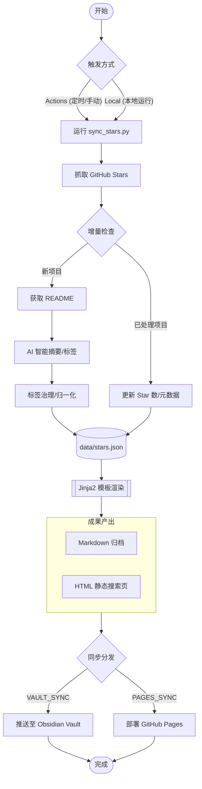

# GitHub Stars Index

[English](README.en.md) | 中文

> 自动抓取 GitHub Stars，生成 AI 摘要，便于检索。

## 目录

- [功能特性](#功能特性)
- [快速开始](#快速开始)
- [配置项详解](#配置项详解)
- [Obsidian 同步（可选）](#obsidian-同步可选)
- [本地运行](#本地运行)

---

## 功能特性

- 🤖 自动抓取 GitHub 账号 Star 的全部仓库
- 📝 为每个仓库读取 README，调用 AI 生成内容摘要和技术标签
- 🏷️ **标签智能治理**：内置 `TAG_MAPPING` 映射库，自动合并同义词、归一化技术栈（如 LLM -> AI 大模型），拒绝标签爆炸（可能效果也不好）
- ⚡️ **高效率**：支持**并发调用** AI 接口，大幅提升处理大量新项目时的速度
- 🗃️ **数据驱动**：运行时使用 `data/stars.json`，发布到 `gh-pages/data/stars.json`，支持二次开发
- 🎨 **模版驱动**：使用 Jinja2 模版生成 Markdown 和 HTML 静态页面
- ⏭️ **智能增量**：新项目调用 AI 总结，旧项目**自动同步最新的 Star 数和元数据**
- ⏰ GitHub Actions **定时自动运行**，cron 表达式自由配置
- 🔄 可选：自动将生成的 `stars_zh.md` & `stars_en.md` **推送到 Obsidian Vault 仓库**
- 🌐 可选：自动同步到 **GitHub Pages** 分支，支持多语言 (ZH/EN) 切换与页面实时搜索
- 💻 支持任意 **OpenAI 格式兼容接口**（OpenAI / Azure / 本地 Ollama 等）

---

## 流程概览



---


## 快速开始

### 第一步：Fork 本仓库

点击右上角 **Fork**，将本仓库复制到你自己的账号下。

> [!IMPORTANT]
> 本站模板已内置 `analytics.1step.dev` 网站分析脚本，默认 `data-website-id` 为 `GitHubStarsIndex`。Fork 后请改成你自己的站点 ID，或直接删除 `templates/index.html.j2` 底部的脚本，避免统计数据混入原项目仪表板。

### 第二步：配置运行环境（二选一）

本项目通过环境变量驱动。脚本的配置优先级为：**内置默认值 < `config.yml` < 环境变量**；本地 `.env` 会被加载为环境变量。GitHub Actions 则通过工作流把 Repository Secrets/Variables 注入为环境变量。

#### 方案 A：GitHub Actions（推荐，适合持续运行）

进入你 Fork 后仓库的 **Settings → Secrets and variables → Actions**。

> [!IMPORTANT]
> - **Secrets** 用于 API Key、Token 等敏感值，通过 `${{ secrets.NAME }}` 读取；**Variables** 用于用户名、模型名、URL、开关等非敏感配置，通过 `${{ vars.NAME }}` 读取。两者是不同命名空间，同名 Secret 不会自动成为 Variable。
> - 当前工作流没有声明 `environment:`，因此请创建 **Repository secrets / Repository variables**，不要创建 Environment 级别配置。
> - 未创建的 Repository Variable 会以空字符串传入工作流。为避免空值覆盖脚本默认值，下面列出的基础 Variables 请显式创建。

**Repository secrets**

| 名称 | 是否必填 | 说明 |
| --- | --- | --- |
| `AI_API_KEY` | 必填 | AI 服务商 API Key |
| `VAULT_PAT` | 条件必填 | 仅开启 Obsidian Vault 跨仓库同步时需要；目标仓库需有 Contents: Write 权限 |
| `GITHUB_TOKEN` | 无需创建 | GitHub Actions 会为每个 Job 自动生成，工作流已自动注入 |

**Repository variables**

| 名称 | 建议值 | 说明 |
| --- | --- | --- |
| `GH_USERNAME` | 你的 GitHub 用户名 | 要抓取 Stars 的账号；必须放在 Variables |
| `AI_BASE_URL` | 见下方服务商示例 | OpenAI 兼容接口地址 |
| `AI_MODEL` | 见下方服务商示例 | 服务商提供的模型 ID |
| `MAX_CONCURRENCY` | `1` | 首次全量同步或订阅制/Token Plan API 建议从 1 开始 |
| `OUTPUT_FILENAME` | `stars` | 生成 `stars_zh.md` / `stars_en.md` |
| `PAGES_SYNC_ENABLED` | `true` | 发布 GitHub Pages；不配置时不会发布 |
| `VAULT_SYNC_ENABLED` | `false` | 是否同步到 Obsidian Vault |
| `VAULT_REPO` | `owner/repo` | 仅开启 Vault 同步时填写 |
| `VAULT_SYNC_PATH` | `GitHub-Stars/` | 仅开启 Vault 同步时填写 |

`TEST_LIMIT` 不需要创建成 Variable。它来自手动运行工作流时的 `test_limit` 输入框。

**常用 AI 服务商示例**

| 服务商 | `AI_BASE_URL` | `AI_MODEL` | 并发建议 |
| --- | --- | --- | --- |
| MiniMax 中国大陆 | `https://api.minimaxi.com/v1` | `MiniMax-M3` | Token Plan 全量同步建议 `1` |
| DeepSeek | `https://api.deepseek.com` | 使用控制台当前可用模型，例如 `deepseek-v4-flash` | 可从 `5` 开始 |
| OpenAI | `https://api.openai.com/v1` | 使用账号可用模型 | 按账号限额调整 |

API Key 必须与服务区域和 Base URL 匹配。MiniMax 中国大陆 Key 与国际站 Key 不可混用；其他中转或兼容服务请使用其文档提供的 Base URL 和模型 ID。

> [!NOTE]
> “OpenAI 兼容”只表示基础请求格式兼容，不表示所有扩展参数都相同。`response_format`、`thinking`、推理内容字段和限流规则均可能因服务商或模型而异。例如 DeepSeek 与 MiniMax-M3 都支持各自的思考开关，但它不是通用 OpenAI 参数；不要在未核对服务商文档时直接复制扩展参数。

> [!TIP]
> **关于 GitHub API 限制**：
> - **线上运行 (Actions)**：工作流会自动注入 `GITHUB_TOKEN`，额度高达 1,000次/小时，抓取全量 Stars 无压力。
> - **本地运行**：若不配置 `GH_TOKEN`，API 限制为 60次/小时。若 Stars 较多，建议在 `.env` 中填入 `GH_TOKEN` 以提升额度至 5,000次/小时。

#### 方案 B：使用 .env 文件 (适合本地开发)

1. 在仓库根目录，复制 `.env.example` 并重命名为 `.env`。
2. 在 `.env` 中填入必填项。

---

### 第三步：自定义定时频率

编辑 `.github/workflows/sync.yml`，修改 `cron` 表达式：

```yaml
schedule:
  - cron: "0 2 * * 1"  # 示例：每周一凌晨 2 点运行
```

### 第四步：手动触发首次运行

进入 **Actions → 🌟 GitHub Stars Index同步 → Run workflow**，点击运行。

---

## 配置项详解

下表中的“脚本默认值”适用于本地运行时未设置对应环境变量的情况。GitHub Actions 工作流会把缺失的 Repository Variable 注入为空字符串，因此 Actions 用户应按“第二步”显式创建基础 Variables。

| 变量名 | GitHub Actions 存放位置 | 必要性 | 说明 | 脚本默认值 |
| --- | --- | --- | --- | --- |
| `GH_USERNAME` | Repository Variable | 必填 | 要同步的 GitHub 用户名 | - |
| `AI_API_KEY` | Repository Secret | 必填 | AI 接口 Key | - |
| `AI_BASE_URL` | Repository Variable | Actions 必填 | OpenAI 兼容接口地址 | `https://api.openai.com/v1` |
| `AI_MODEL` | Repository Variable | Actions 必填 | 使用的 AI 模型 ID | `gpt-4o-mini` |
| `OUTPUT_FILENAME` | Repository Variable | Actions 建议显式设置 | Markdown 文件名基准 | `stars` |
| `MAX_CONCURRENCY` | Repository Variable | 建议显式设置 | AI 并发处理数；Token Plan 建议 `1` | `5` |
| `VAULT_SYNC_ENABLED` | Repository Variable | 可选 | 是否开启 Obsidian 同步 | `false` |
| `VAULT_REPO` | Repository Variable | 开启 Vault 时必填 | Vault 仓库 (`owner/repo`) | - |
| `VAULT_SYNC_PATH` | Repository Variable | 可选 | Vault 目标目录 | `GitHub-Stars/` |
| `VAULT_PAT` | Repository Secret | 开启 Vault 时必填 | 目标仓库写入 Token | - |
| `PAGES_SYNC_ENABLED` | Repository Variable | 发布网页时必填 | 只有值严格等于 `true` 才部署 Pages | `false` |
| `GH_TOKEN` | 仅本地 `.env` | 本地建议 | 提升本地 GitHub API 额度；Actions 使用自动生成的 `GITHUB_TOKEN` | - |
| `TEST_LIMIT` | Workflow 输入 / 本地 `.env` | 可选 | 单次最多处理多少个新项目；Actions 中不要创建同名 Variable | - |

### 全量同步与 AI 限流

首次全量同步可能产生数百次 AI 请求。订阅制或 Token Plan API 常按并发数、RPM、TPM 或滚动窗口限流；即使 Action 最终成功，部分仓库也可能显示“生成失败”。建议：

1. 首次验证使用 `force_rebuild=true`、`test_limit=5`。
2. 验证 Pages 与 AI 输出正常后，改用 `force_rebuild=false`，每次将 `test_limit` 设为 `20`～`50` 分批追加。
3. MiniMax Token Plan 等订阅接口将 `MAX_CONCURRENCY` 设为 `1`；按量付费且额度充足时再逐步提高。
4. 遇到 HTTP 429 时先停止新任务，等待服务商限流窗口恢复，再以 `force_rebuild=false` 重跑。正常完成的任务会从 `gh-pages/data/stars.json` 增量恢复；**取消正在运行的 Action 可能丢失本轮尚未保存的数据**。
5. 全量完成后，日常定时任务只会为新增 Star 调用 AI，负载会明显降低。

---

## Obsidian 同步（可选）

该功能允许你将生成的 Stars 汇总自动推送到你的 Obsidian Vault (或任何其他) GitHub 仓库中，实现笔记软件内的自动更新。

### 核心机制
**本质是跨仓库自动同步**：许多 Obsidian 用户使用 GitHub 仓库来存储和同步笔记。本项目通过 GitHub API，将生成的 Markdown 文件直接推送到你指定的另一个仓库中（你的 Vault 仓库）。

### 配置步骤

1.  **准备目标仓库**: 确保你的 Obsidian Vault 已经托管在 GitHub 上。
2.  **创建权限 Token (PAT)**:
    - 访问 [Fine-grained PAT 配置页](https://github.com/settings/personal-access-tokens)。
    - **Repository access**: 选择 "Only select repositories"，并选中你的 **Vault 仓库**。
    - **Permissions**: 在 "Repository permissions" 中，设置 **Contents** 为 **Read and write**。
    - 生成 Token 后，将其存入本项目的 **Settings -> Secrets -> Actions** 中，命名为 `VAULT_PAT`。
3.  **开启同步配置**:
    - 在本项目的 **Settings -> Variables -> Actions** 中：
        - 设置 `VAULT_SYNC_ENABLED` 为 `true`。
        - 设置 `VAULT_REPO` 为 `你的用户名/仓库名` (例如 `iblogc/my-obsidian-vault`)。
        - 设置 `VAULT_SYNC_PATH` 为你希望在 Vault 中存放的目录 (例如 `Reading/GitHub-Stars/`)。
4.  **保存完成**: 下次 Action 运行时，生成的 `stars_zh.md` 和 `stars_en.md` 将会自动出现在你的 Vault 仓库中。

> [!TIP]
> **本地如何查收？**
> 远程同步完成后，你只需在本地 Obsidian 中使用 **Obsidian Git** 插件执行拉取 (Pull)，或者手动在仓库目录下 `git pull`，最新的 Stars 摘要就会出现在你的笔记库中了。

---

## GitHub Pages 部署（可选）

本项目自动生成支持多语言、支持实时搜索的静态网页：

1. 在 Repository Variables 中显式设置 `PAGES_SYNC_ENABLED=true`。当前脚本默认值为 `false`；未配置时部署步骤会显示 **Skipped**，但整个 Action 仍可能显示成功。
2. Fork 后第一次运行建议选择 `force_rebuild=true`、`test_limit=5`，清除 Fork 继承的原作者数据并验证部署。
3. 确认 Action 中“部署到 GitHub Pages”步骤实际执行成功，然后进入 **Settings → Pages**。
4. **Source** 选择 `Deploy from a branch`，**Branch** 选择 `gh-pages`，目录选择 `/(root)`，保存。
5. 等待 1～5 分钟，通过 `https://<你的用户名>.github.io/<仓库名>/` 访问。例如仓库 `van14shu/GithubStarsIndex` 对应 `https://van14shu.github.io/GithubStarsIndex/`。
6. 测试成功后使用 `force_rebuild=false`、`test_limit` 留空或分批运行，补齐剩余 Stars。

> [!IMPORTANT]
> **数据源迁移说明（兼容 Fork）**：
> - 当前推荐的数据源为 `gh-pages/data/stars.json`。
> - `main` 分支中的 `data/stars.json` 仅用于首次迁移兼容（例如 Fork 后第一次运行 Action 的回退读取）。
> - 常规运行不会再把 `data/stars.json` 提交回 `main`。
> - Fork 可能同时继承原仓库的 `gh-pages` 分支。若首次运行没有启用 Pages 或部署步骤被跳过，访问自己的 Pages 地址仍会看到原作者页面；使用 `force_rebuild=true` 并确认部署步骤成功即可替换。

---

## Docker 部署

如果你希望在服务器上长期运行并自动同步，推荐使用 Docker Compose。

### 1. 准备配置
复制 `.env.example` 为 `.env` 并填写必要信息：
```bash
cp .env.example .env
# 编辑 .env 填入 GH_USERNAME、AI_API_KEY 和 GH_TOKEN
```

> [!IMPORTANT]
> **必须填写 GH_TOKEN**：在 Docker 环境中请求 GitHub API 极易触发 [Rate Limit](https://docs.github.com/en/rest/using-the-rest-api/rate-limits-for-the-rest-api)。如果不配置 `GH_TOKEN`，API 限制为 60次/小时，抓取稍多 Stars 就会报错。配置后限额提升至 5,000次/小时。

### 2. 启动服务
使用 Docker Compose 一键启动：
```bash
docker compose up -d
```
该命令会启动两个容器：
- `sync`: 核心同步脚本。默认每 **24 小时** 自动抓取并生成一次。你可以在 `.env` 中设置 `SCHEDULE_HOURS` 来调整间隔。
- `web`: 基于 Nginx 的静态服务器，用于展示生成的索引页面。

### 3. 访问页面
打开浏览器访问：`http://localhost:8080`

### 4. 常用管理命令
```bash
# 查看同步日志
docker logs -f github-stars-sync

# 立即执行一次强制同步（不等待周期）
docker compose run --rm sync

# 仅更新页面渲染（不调用 AI）
docker compose run --rm sync --render-only
```

---

## 本地运行

```bash
# 克隆仓库并安装依赖
git clone https://github.com/iblogc/GithubStarsIndex.git
cd GithubStarsIndex

# 安装依赖
pip install -r requirements.txt
# 或者使用 uv (推荐)
uv pip install -r requirements.txt

# 使用 .env 进行配置
cp .env.example .env
# 编辑 .env 填入 AI_API_KEY 和 GH_USERNAME

# [常规运行] 获取原信息、调用 AI 总结并渲染页面
python scripts/sync_stars.py
# 或者
uv run scripts/sync_stars.py

# [仅渲染模式] 跳过抓取和 AI 总结，仅依据本地 stars.json 极速重新渲染 HTML/MD
python scripts/sync_stars.py --render-only
```

---

## 文件说明

| 文件                         | 说明                               |
| :--------------------------- | :--------------------------------- |
| `data/stars.json`            | 运行时临时数据文件（兼容迁移入口） |
| `templates/`                 | Jinja2 生成模版（Markdown/HTML）   |
| `dist/`                      | 自动生成的本地成品（HTML / MD）    |
| `scripts/sync_stars.py`      | 核心同步与生成脚本                 |
| `.github/workflows/sync.yml` | GitHub Actions 定时工作流          |
| `.env.example`               | 配置示例文件                       |

---

## 附录：申请 GitHub Token (GH_TOKEN)

为了保证程序能够顺畅抓取你的全部 Stars，建议申请一个具有只读权限的人员访问令牌（Personal Access Token）。

### 申请步骤：
1.  访问 [GitHub Fine-grained PAT 页面](https://github.com/settings/personal-access-tokens/new)。
2.  **Token name**: 填写 `Stars-Index-Sync` (或任意你喜欢的名字)。
3.  **Expiration**: 建议选择 `90 days` 或 `Custom`。
4.  **Resource owner**: 选择你的个人账号。
5.  **Repository access**: 选择 `Public Repositories (read-only)` 即可，或者选 `All repositories`。
6.  **Permissions**: 无需额外特殊权限，默认的公共访问权限已足够抓取 Stars 列表。
7.  点击 **Generate token**，**立即复制并保存**该 Token。
8.  将此 Token 填入 `.env` 文件的 `GH_TOKEN` 字段中。

> [!TIP]
> 如果你也开启了 **Obsidian 同步 (Vault Sync)**，可以直接复用具有写入权限的 `VAULT_PAT` 作为 `GH_TOKEN`。
